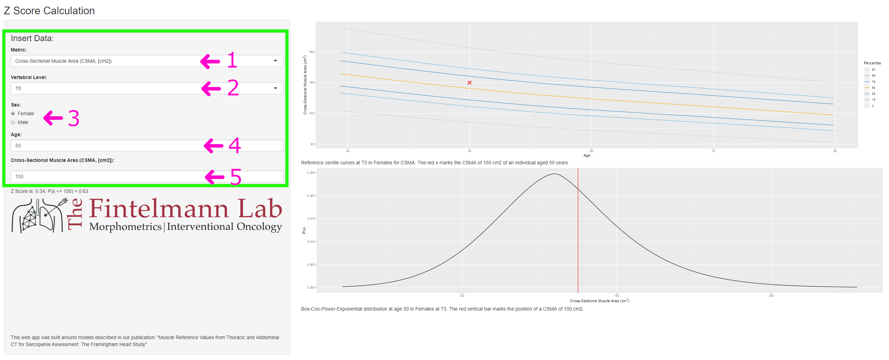

# R Shiny App: "Muscle Reference Values from Thoracic and Abdominal CT for Sarcopenia Assessment: The Framingham Heart Study"

Visit [muscle-metrics.mgh.harvard.edu](https://muscle-metrics.mgh.harvard.edu) for an online version of this application. Please cite the [associated publication](#associated-publication) when using the reference values.

## The App
For the publication "Muscle Reference Values from Thoracic and Abdominal CT for Sarcopenia Assessment: The Framingham Heart Study", statistical models were created using the LMSP method to facilitate the comparison of individual measurements to the study cohort. We refer to the publication for a documentation on how models were created.

### Functionality: 
- calculation of **z-scores** (how many standard deviations an individual's measurement falls from the estimated population median)
- graphical representation of how the measurement compares to the reference group
- calculation of P(x<=y)
	- where y is an individual measurement

### How to use the App:

#### Running the App:

##### Running the app online:
Visit [muscle-metrics.mgh.harvard.edu](https://muscle-metrics.mgh.harvard.edu) for an online version of this application.

##### Alternative: Running in R Studio:
1. Install [R and R Studio](https://posit.co/download/rstudio-desktop/) (or any other R IDE of choice)
2. In R, run: 
	1. `install.packages(c("shiny", "gamlss", "tidyverse"))`
	2. `runGitHub(repo="FintelmannLabDevelopmentTeam/MuscleReferenceValuesFHS_ShinyApp", ref="master")`
	3. The app should now be downloaded and then run on your system.

Steps 1. and 2.1 only have to be followed when running the app for the first time.

#### Comparing measurements:

**1. Insert individual's data:**

Legend:
1. The metric measured (e.g., cross-sectional muscle area)
2. The vertebral level of the axial image on which muscle was analyzed
3. The individual's sex
4. The individual's age
5. The individual's measurement

**2. Read out the results:**

1. The light blue box marks the result section - the **z-score** and P(x<=measurement) are given.
2. On the right, two graphical representations of where the measurement falls compared to the estimated population distribution are shown.

#### Batch Processing Data

A code example of how to perform batch processing using R is available in `batch_processing_data.R`.

## Contact
This tool was built by P. Erik Tonnesen. Please contact him or the corresponding author of the associated publication if questions or problems should arise.

## Associated publication
Tonnesen, P. Erik; Mercaldo, Nathaniel D. PhD; Tahir, Ismail MB, BCh, BAO; Dietrich, Anna-Sophia W.; Amayri, Wael BSc; Graur, Alexander; Allaire, Brett BSc; Bouxsein, Mary L. PhD; Samelson, Elizabeth J. PhD; Kiel, Douglas P. MD, MPH; Fintelmann, Florian J. MD. Muscle Reference Values From Thoracic and Abdominal CT for Sarcopenia Assessment: The Framingham Heart Study. Investigative Radiology ():10.1097/RLI.0000000000001012, September 19, 2023. | [DOI: 10.1097/RLI.0000000000001012](doi.org/10.1097/RLI.0000000000001012)
